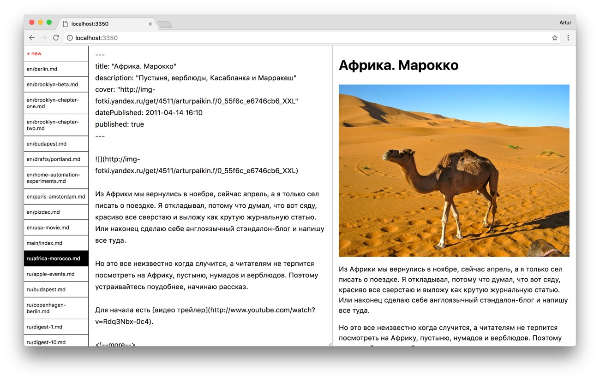

# Tent


Experimental admin interface to static sites / notes / whatever. Editor for Markdown body with YAML frontmatter fields and a cool live preview. Plus drag and drop image/file upload with resizing and optimization built it :sparkles: Built with Hyperapp and/or Preact. WIP.



## Features

* Separate components that you can mix and match
* Supports deeply nested fields, objects and arrays

## Usage

```sh
npm install
npm start
```
